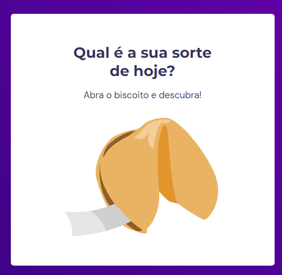

# Fortune-Cookie

## 💻 Sobre o desafio

Neste desafio foi criado um jogo chamado Biscoito da Sorte, no qual o usuário, a partir de um clique, abre um biscoito com a sua sorte do dia.

<strong><a href="https://pedro-jelev.github.io/Fortune-Cookie/">Aqui</a> você pode acessar o site e testar a sua sorte!</strong>

 

  

## ⚙️ Alterando o conteúdo

Você também pode escolher quais frases irão aparecer no Fortune Cookie, para isso vá no arquivo <strong>assets > JS > main.js</strong> e altere as frases de <code> const luck</code>, que está dentro da função <code>phrase().</code>

 

## 🚀 Rocketseat

Este exercício foi proposto pela rocketseat no curos Explorer. Para mais informações <a href="https://www.rocketseat.com.br">Clique Aqui</a>

  

